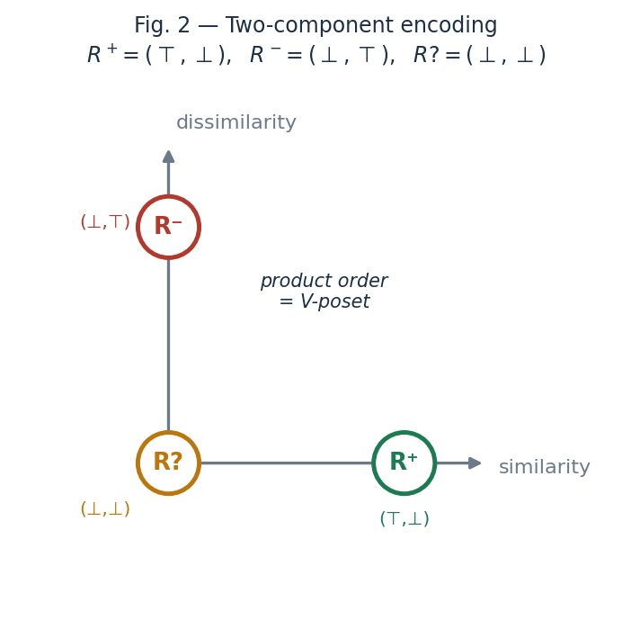
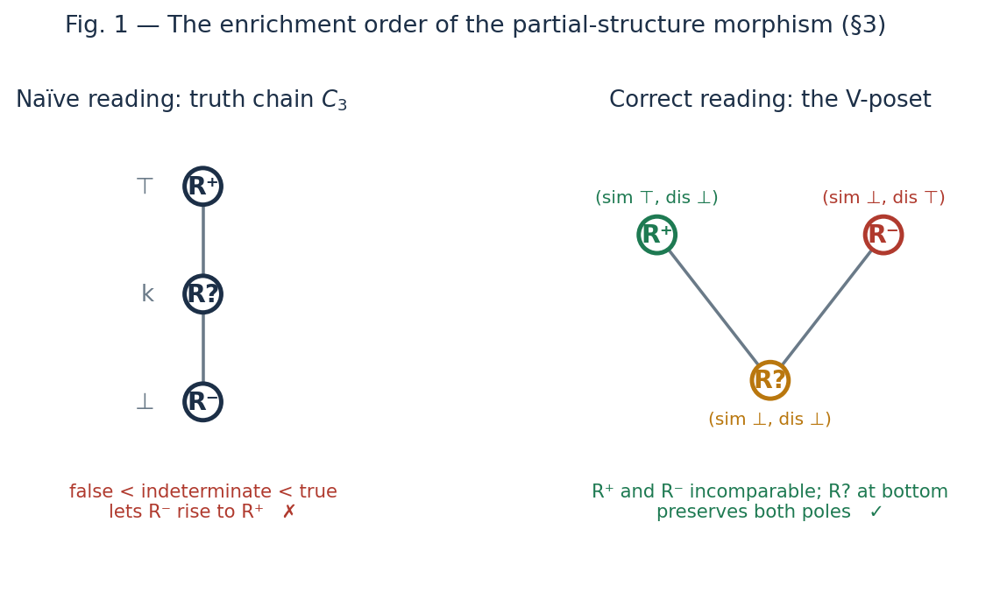
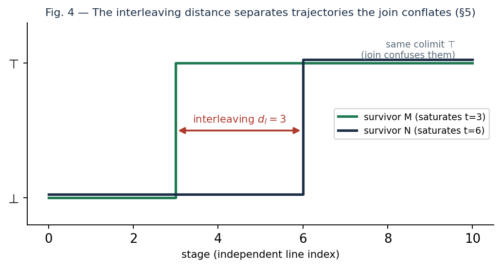
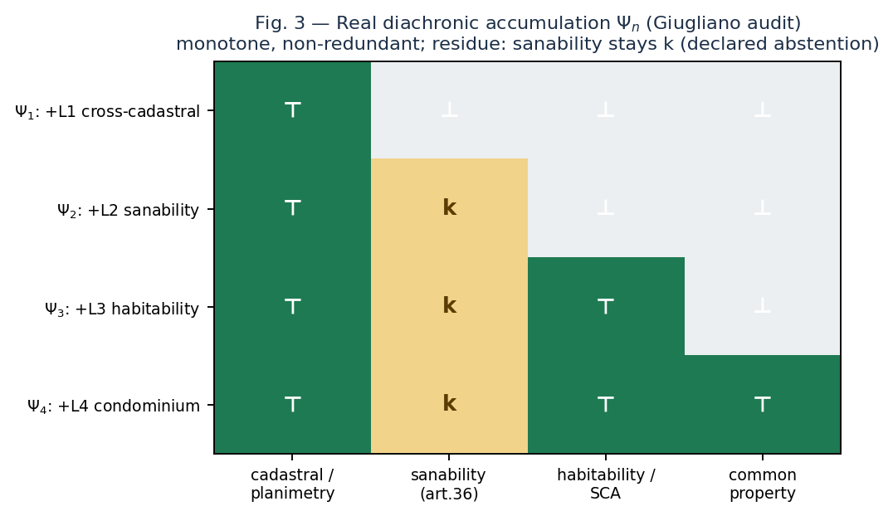

# Graded, asymmetric commensurability is not a quantale-enriched distributor: a transitivity obstruction, and a persistence-module alternative

*Draft — written step by step. Every claim carries an explicit status (Proved / Application / Open).
Nothing here is "validated": closing what remains open requires external expert review.*

**Author:** Edoardo Gazzoni · independent researcher · ORCID: 0009-0004-2525-256X · **Date:** July 2026

**Engine:** the adversarial audit procedure that produced and attacked this paper is open source: [`github.com/eddo-cto/adversarial-audit-engine`](https://github.com/eddo-cto/adversarial-audit-engine) (MIT, v0.10.1). **Companion:** *Managing epistemic circularity in self-referential evaluation: the survivor gate, and how three scientific ledgers resolve indeterminacy*, which applies the C₃ quantale and the interleaving distance developed here to three real reliability ledgers. **Archive:** both papers and the replication package are deposited on Zenodo, DOI ⟨DOI da inserire⟩.

---

## Abstract

An adversarial audit does not yield truth; it yields *survivors* — artefacts whose parts have been,
some corroborated, some falsified, and many left undetermined. We ask how to measure the *reliability*
of a survivor as **graded, asymmetric, diachronic commensurability** with independent reference lines,
and we locate its correct formal home. Modelling survivors as **partial structures** (da Costa–French),
we first show a negative result: the natural three-valued *chain* does not capture the partial
homomorphism, which instead lives on the two-diagonal enrichment D∗(C₃)×B∗(C₃) of a quantale-valued
similarity/dissimilarity (Lai–Shen–Tao–Zhang). We then prove a **transitivity obstruction**: the
composition law of a quantale-enriched category *is* transitivity, so a non-transitive commensurability
(as similarity generically is, after Tversky) is not such a category; the tempting *static distributor*
model is therefore inadequate on principled — not merely statistical — grounds. What survives is the
**diachronic** structure: the accumulation of per-line commensurability is a supremum in the lattice
Q-Rel of quantale-valued relations, and the reliability of a survivor is a **generalized persistence
module** ℕ → Q-Rel (Bubenik–de Silva–Scott), whose non-trivial, stable invariant is the **interleaving
distance** between accumulation trajectories; the directional case is a **Lawvere quasi-metric**
(interleaving on a category with a flow, de Silva–Munch–Stefanou). We are explicit about status: the
positive formal home is a correct *application* of existing machinery, while the load-bearing results
are the two negatives and a method — an independence-first, survivor-gated audit — validated by
construction across eleven external-review rounds. All finite claims are checked exhaustively by
deterministic scripts included in an appendix.

**Keywords:** partial structures; quasi-truth; quantale-enriched categories; distributors;
non-transitive similarity; generalized persistence modules; interleaving distance; Lawvere quasi-metrics;
adversarial audit; reliability.

---

## 1. Introduction

An *adversarial audit* subjects an artefact — a claim, an appraisal, a model — to grounding and defence
gates and reports what remains. The output is not a truth value but a **survivor**: an object whose
components have been, some corroborated, some falsified, and — in any honest audit — most left
*undetermined*. This paper asks a single question: what is the right formal notion of the **reliability**
of a survivor, and where does it live?

We take reliability to be **commensurability** with independent reference lines: not "is the survivor
true?" but "how much of its determined content is matched by an independent line, and in which
direction?". Three features are forced by the application and organise the paper. Commensurability is
**graded** (matching comes in degrees), **asymmetric** (a survivor may be fully covered by a broad line
without the line being covered by the survivor), and **diachronic** (reliability is built up as
independent lines accumulate, and is never closed from within). We model survivors as **partial
structures** in the sense of da Costa and French, whose positive / negative / undetermined extensions
R⁺ / R⁻ / R? are exactly the audit's corroborated / falsified / residual parts.

The contribution is as much *negative* as positive, and we are deliberately anti-hype about which is
which. Two natural formalisations fail, each for an instructive reason, and ruling them out is the
load-bearing content; the surviving positive model is a correct *application* of existing machinery
rather than new mathematics. Concretely:

- **(C1) The morphism of partial structures is not a functor on a truth chain.** Encoding the three
  values on a chain ⊥ < k < ⊤ makes the partial homomorphism into a quantale-enriched functor — but this
  is false: the chain lets a *false* pair rise to a *true* one, which the partial homomorphism forbids.
  The correct enrichment is the **two-diagonal** structure D∗(C₃)×B∗(C₃) of quantale-valued similarity
  and dissimilarity (Lai–Shen–Tao–Zhang), i.e. the unique partial order (a "V", with R? at the bottom
  and R⁺, R⁻ incomparable) under which the morphism is monotone (§3).

- **(C2) A static distributor cannot be the home: a transitivity obstruction.** The composition law of a
  quantale-enriched category *is* transitivity. Hence a non-transitive commensurability — and similarity
  is generically non-transitive (Tversky) — is not such a category, and the tempting model of
  commensurability as a static **distributor** is inadequate on *principled*, not merely statistical,
  grounds. Distributors are at most a *closed slice* of the ambient lattice of relations (§4).

- **(C3) Reliability is a persistence module; its invariant is a stable interleaving distance.** What
  survives is the **diachronic** structure. Per-line commensurability is a plain quantale-valued relation
  (no action laws, so free of the obstruction); accumulation is the supremum in the relation lattice
  Q-Rel; and the reliability of a survivor is a **generalized persistence module** ℕ → Q-Rel
  (Bubenik–de Silva–Scott). Its non-trivial, *stable* invariant is the **interleaving distance** between
  accumulation trajectories — which distinguishes survivors that the mere final supremum conflates — and
  the **directional** refinement is a **Lawvere quasi-metric** (interleaving on a category with a flow,
  de Silva–Munch–Stefanou), returning the asymmetry to the Lawvere setting the framework began in (§5).

- **(C4) Explicit status and reproducibility.** Every finite claim is checked *exhaustively* over its
  value space by short deterministic scripts (appendix); each result is tagged Proved / Application /
  Open. We are explicit that the positive home (C3) is a correct *application* of existing machinery, so
  the results that stand on their own are the two negatives C1 and C2. (How these conclusions were
  reached — an independence-first, survivor-gated review process — is discussed in §6, not claimed as a
  formal contribution.)

**Organisation.** Section 2 fixes the three ingredients (partial structures; the quantale C₃ and its two
diagonals; quantale-enriched categories, distributors, and the relation lattice Q-Rel) and recalls
generalized persistence modules. Section 3 proves (C1). Section 4 proves the transitivity obstruction
(C2). Section 5 builds the diachronic home and its interleaving invariant (C3). Section 6 discusses the
honest weight of each result and the method. Section 7 situates the work; Section 8 concludes. An
appendix documents the reproducible checks.

---

## 2. Preliminaries

We fix three ingredients exactly as they appear in the primary sources, since every later result depends
on the axioms verbatim, and recall the notion of a generalized persistence module.

### 2.1 Partial structures and their morphisms

**Definition 2.1 (partial structure; da Costa–French).** A *partial structure* is a pair
A = (D, (Rᵢ)ᵢ∈I), where D is a non-empty domain and each Rᵢ is a *partial relation* of arity nᵢ: a map
that assigns to every tuple of D^{nᵢ} one of three values, partitioning D^{nᵢ} into a *positive*
extension Rᵢ⁺ (tuples known to satisfy Rᵢ), a *negative* extension Rᵢ⁻ (tuples known not to), and an
*undetermined* extension Rᵢ? (neither).

**Definition 2.2 (quasi-truth).** A is *quasi-true* if it admits a total extension — resolving every Rᵢ?
into Rᵢ⁺ or Rᵢ⁻ — that is true in the ordinary sense. Quasi-truth is thus truth *in some* completion.
For a survivor, R⁺ is what passed the grounding gate, R⁻ what the defence falsified, and R? the residue
the audit declares and does not close.

**Definition 2.3 (partial morphisms; Bueno–French–Ladyman).** A *partial homomorphism* f: A → B is a map
of domains such that, for each relation, ā ∈ Rᵢ⁺ ⟹ f(ā) ∈ Sᵢ⁺ and ā ∈ Rᵢ⁻ ⟹ f(ā) ∈ Sᵢ⁻; the
undetermined extension is free. A *partial isomorphism* is a bijection that *preserves and reflects* both
determined extensions. The point to retain: the partial homomorphism constrains the positive and
negative poles *independently*, and leaves the middle free.

### 2.2 The quantale C₃ and its two diagonals

**Definition 2.4 (quantale).** A (commutative, unital) *quantale* is a complete lattice (Q, ≤, ⋁) with an
associative, commutative product & that distributes over arbitrary suprema and has a unit e.

We work over the three-element quantale of Lai–Shen–Tao–Zhang: **C₃ = {⊥ < k < ⊤}**, the three-chain,
commutative and *non-integral*, with **unit k**, ⊤ & ⊤ = ⊤, and ⊥ absorbing. The table is thereby
determined (k & q = q, ⊥ & q = ⊥, ⊤ & k = ⊤, ⊤ & ⊥ = ⊥); residuation is a → b = ⋁{c : a & c ≤ b} and
negation ¬a = a → ⊥ gives ¬⊥ = ⊤, ¬k = ¬⊤ = ⊥. Two facts matter: the unit **k is interior** (not the
top), and it is the **middle value — the indeterminate**; in the category axiom below a self-hom will be
≥ k, i.e. ≥ *indeterminate*, not ≥ *true*.

Lai et al. build, *without using negation*, two dual C₃-valued structures: a **similarity** diagonal
D∗(C₃) and a **dissimilarity** diagonal B∗(C₃), dissimilarity being a positive notion in its own right
rather than the complement of similarity. In their development both are **symmetric**. We shall need both
diagonals — but, crucially, without the symmetry.

### 2.3 Quantale-enriched categories, distributors, and the relation lattice

**Definition 2.5 (Q-category; Stubbe).** A *Q-category* A is a set of objects with, for each ordered
pair, a hom-value A(a′, a) ∈ Q subject to just two inequalities: *composition*
A(a″, a′) & A(a′, a) ≤ A(a″, a), and *identity* e ≤ A(a, a). There is no symmetry, no separation, and no
terminal object: this is Lawvere's *generalized metric space*, natively asymmetric.

**Definition 2.6 (distributor; Stubbe).** A *Q-distributor* Φ: A ⇸ B is a matrix Φ(b, a) ∈ Q that is a
bimodule: B(b′, b) & Φ(b, a) ≤ Φ(b′, a) and Φ(b, a) & A(a, a′) ≤ Φ(b, a′). Distributors compose by
convolution and admit suprema computed elementwise.

**Definition 2.7 (the relation lattice Q-Rel).** For fixed object-sets, **Q-Rel(B, A)** is the complete
lattice of *all* matrices B × A valued in Q, ordered and joined elementwise. Distributors form a
sub-poset of Q-Rel — indeed the reflective sub-poset of relations closed under the Isbell double-closure
— but a general element of Q-Rel need satisfy no action law.

### 2.4 Generalized persistence modules

**Definition 2.8 (generalized persistence module; Bubenik–de Silva–Scott).** Given a preordered set P and
a category C, a *generalized persistence module* is a functor M: P → C. Two modules M, N over P (equipped
with a translation structure) are ε-*interleaved* when there are compatible families of morphisms
M(t) → N(t + ε) and N(t) → M(t + ε); the *interleaving distance* is the least such ε, and the theory
supplies *soft* (categorical) stability theorems that hold for an arbitrary target C. We shall take
P = ℕ and C = Q-Rel.

---

## 3. The morphism of partial structures is not a functor on a truth chain

Consider the load-bearing case of a single *binary* partial relation R on a domain D, so each ordered
pair receives a value in {R⁺, R⁻, R?}. We seek the enriched setting in which the partial homomorphism of
Definition 2.3 becomes the *native* morphism. Throughout, both the partial homomorphism and each
candidate morphism are *universally quantified conjunctions of a predicate that depends only on the pair
of values* (r_A(x, y), r_B(fx, fy)) ∈ {R⁺, R⁻, R?}². Hence two such conditions are equivalent on all
domains iff their per-pair predicates agree on the nine value-pairs — this is the mechanism behind every
"for all domains" claim below, and it makes the finite check a proof rather than a sample.

### 3.1 The chain reading fails

Placing the three values on a truth chain ⊥ < k < ⊤ via R⁻ ↦ ⊥, R? ↦ k, R⁺ ↦ ⊤ turns a
structure-preserving map into a **C₃-functor** in the sense of Definition 2.5, i.e. a map f with

  r_A(x, y) ≤ r_B(fx, fy)   for all x, y ∈ D.   (∗)

**Proposition 3.1 (C1, negative).** Condition (∗) is *not* equivalent to the partial homomorphism: there
are maps satisfying (∗) that fail to preserve R⁻.

*Proof.* Take the value-pair a = R⁻ (= ⊥), b = R⁺ (= ⊤). Then (∗) requires ⊥ ≤ ⊤, which holds; but the
partial homomorphism requires that a tuple in R⁻ map into R⁻, and here it maps into R⁺, which is
forbidden. The two per-pair predicates therefore disagree on this pair, breaking the equivalence.
Exhaustively they disagree on 3 of the 9 value-pairs (and on 7 948 of the 26 244 instances with |D| = 2;
see the appendix). ∎

The defect is conceptual, not incidental. A truth chain orders the indeterminate *between* false and
true, so by transitivity it permits false to rise to true. But for a partial structure R⁻ and R⁺ are
*independent* poles that a faithful morphism must guard separately; no total order on three elements can
do this. What is needed is a non-total order.

### 3.2 The two-component reading works

Represent each value by the pair (similarity, dissimilarity) of the two diagonals of §2.2:
R⁺ ↦ (⊤, ⊥), R⁻ ↦ (⊥, ⊤), R? ↦ (⊥, ⊥). Write sim(·), dis(·) for the two components. A *two-component*
morphism is a map f monotone in both: sim r_A(x, y) ≤ sim r_B(fx, fy) and dis r_A(x, y) ≤ dis r_B(fx, fy)
for all x, y.

**Proposition 3.2 (C1, positive).** f is a partial homomorphism iff it is monotone in both components; f
is a partial isomorphism iff it is an isometry in both (equality of each component). Both equivalences
hold over every domain and every arity.

*Proof.* On the similarity component, "sim a ≤ sim b" with sim the indicator of R⁺ says exactly
"a ∈ R⁺ ⟹ b ∈ R⁺" (since sim = ⊤ only on R⁺); on dissimilarity, "dis a ≤ dis b" says exactly
"a ∈ R⁻ ⟹ b ∈ R⁻". Their conjunction is, verbatim, Definition 2.3. The two per-pair predicates agree on
all nine value-pairs (0 disagreements, appendix); since both conditions are the universal closure of
their per-pair predicate over the tuples, the equivalence lifts to every domain and arity. The
isomorphism statement follows by replacing the two implications with equivalences. ∎

We are candid about the weight of Proposition 3.2 in §6: on its own it is close to a restatement of
Definition 2.3. Its role is to isolate the two components as the primitive data; the content lies in the
negative result 3.1 and in the identification of the ambient order, next.

### 3.3 The enrichment order is the two-diagonal, not the chain

**Proposition 3.3 (C1, reconciliation).** On the set {R⁺, R⁻, R?} there is a unique partial order ≤ for
which "partial homomorphism" is equivalent to "r_A(x, y) ≤ r_B(fx, fy) pointwise": the **V-poset** with
R? least and R⁺, R⁻ incomparable. This order coincides with the product order of the two components
(sim, dis) — that is, with the two-diagonal structure D∗(C₃) × B∗(C₃) — and it does *not* coincide with
the chain ⊥ < k < ⊤ of C₃.

*Proof.* The per-pair predicate of the partial homomorphism, R(a, b) := (a∈R⁺→b∈R⁺) ∧ (a∈R⁻→b∈R⁻),
evaluated on the nine pairs, yields exactly R? ≤ R⁺, R? ≤ R⁻ and the three reflexivities, and nothing
else; R⁺ and R⁻ remain incomparable. R is reflexive, antisymmetric and transitive, hence a partial order
— the V-poset. Since each value is (sim, dis) ∈ {0,1}² with R? = (0,0), R⁺ = (1,0), R⁻ = (0,1), the
componentwise product order gives (0,0) < (1,0), (0,0) < (0,1) with (1,0), (0,1) incomparable: the same
V-poset. The chain, in which ⊥ < k < ⊤ are all comparable, differs. ∎

Thus the commensurability of partial structures is enriched not in the truth chain of C₃ — the naive
reading — but in the **two-diagonal** structure of Lai et al., where similarity and dissimilarity sit on
separate axes. This is exactly why both diagonals D∗ and B∗ are needed: the R⁺/R⁻ bilaterality of partial
structures is the bilaterality the two diagonals encode. The quantale C₃ remains the *base of values*
(with unit k = the indeterminate, which returns in §4 as the resting self-relation), but the *enrichment
order* is the product of its two diagonals — used, as we now require, without Lai et al.'s symmetry.

---

## 4. A static distributor cannot be the home: a transitivity obstruction

Having fixed the enrichment, the tempting next move is to model the commensurability *between* a survivor
A and a reference line B as a single **distributor** Φ: A ⇸ B (Definition 2.6). Such an object exists in
the required asymmetric form.

**Proposition 4.1 (existence of an asymmetric distributor).** There are C₃-categories A, B (with diagonal
forced to the unit k, since a top self-hom together with an off-diagonal k would violate composition —
the resting self-relation is the indeterminate) and a distributor Φ: A ⇸ B satisfying both action laws
with genuinely asymmetric content. *Proof.* Exhaustive over the 3⁴ candidate matrices on two objects per
side: 13 satisfy both action laws, of which 11 have Φ(b₁,a₂) ≠ Φ(b₂,a₁), e.g. Φ = (⊥, k, ⊥, ⊥); the
construction survives a 3-object random stress (500/500 valid, no counterexample). See the appendix. ∎

But *existing* is not *being adequate*, and here the model fails for a principled reason that no amount
of parameter-fitting repairs.

**Theorem 4.2 (transitivity obstruction).** A reflexive C₃-valued commensurability r on a set of objects
is (the hom of) a C₃-category if and only if it is *transitive* in the quantale sense,
r(i, k) & r(k, j) ≤ r(i, j) for all i, j, k.

*Proof.* The composition inequality of Definition 2.5 is precisely r(i, k) & r(k, j) ≤ r(i, j), and
reflexivity gives the identity axiom k ≤ r(i, i). ∎

**Corollary 4.3 (non-transitive commensurability is not a C₃-category).** If r is non-transitive — there
is a triple with r(i, k) = r(k, j) = ⊤ but r(i, j) = ⊥ — then r is not a C₃-category, since
⊤ & ⊤ = ⊤ ≰ ⊥ violates composition. Exhaustively, of the 27 reflexive symmetric commensurabilities on
three objects in C₃ only **5 (18%)** are transitive: transitivity is the exception, not the rule
(appendix).

The consequence is decisive for modelling. Commensurability and similarity are *generically
non-transitive* — a survivor may be commensurable with two lines that are not commensurable with each
other, exactly as perceived similarity fails transitivity (Tversky 1977). By Corollary 4.3 the survivor's
internal commensurability is then not a C₃-category, so the very *object side* of a distributor model
fails upstream; and by Theorem 4.2 forcing commensurability to obey the action laws imposes a transitivity
it does not possess. **Distributors are therefore, at most, a *closed slice* of Q-Rel** — precisely the
reflective sub-poset of Isbell-closed relations (Definition 2.7) — into which projecting the
commensurability discards its non-transitive content.

We record, to forestall a natural rescue attempt, that closing the measured commensurability into that
slice yields a relation statistically indistinguishable from one closed from random data; but the
decisive point is not statistical. It is Theorem 4.2: the action laws demand a transitivity that
commensurability, like similarity, simply lacks. The static distributor is the wrong home — not because
it fails to fit, but because fitting it would misrepresent the object.

---

## 5. The diachronic home: a persistence module on Q-Rel and its interleaving invariant

If commensurability is not a static object, what is it? The application already tells us: reliability is
*built up in time* as independent reference lines accumulate. We take this literally. Each line i
contributes a plain **quantale-valued relation** Φᵢ ∈ Q-Rel(B, A) — a matrix, with *no* action laws, and
therefore free of the obstruction of §4. The commensurability accumulated after n lines is the supremum

  Ψₙ = ⋁_{i ≤ n} Φᵢ   in Q-Rel(B, A).

**Proposition 5.1 (accumulation).** The sequence (Ψₙ) is a monotone chain in Q-Rel(B, A), well defined
for *arbitrary* — in particular non-transitive — contributions Φᵢ. *Proof.* The elementwise join of
matrices is a matrix, and Ψₙ ≤ Ψₙ₊₁ by construction of the join. ∎

The filtration ℕ → Q-Rel, n ↦ Ψₙ, is thus a **generalized persistence module** in the sense of
Definition 2.8. The immediate worry is that this trivialises — that "reliability is a monotone join" says
nothing. It does not, once the right invariant is used: the **interleaving distance** between two
survivors' accumulation trajectories. Since Q-Rel is a poset, for modules M, N over ℕ the ε-interleaving
condition (Definition 2.8) is simply M(t) ≤ N(t + ε) and N(t) ≤ M(t + ε) elementwise for all t, and the
interleaving distance d_I(M, N) is the least such ε. We verify its content (appendix,
`verifica_interleaving_giro10.py`):

- **Non-triviality.** Two survivors with the *same* colimit (final join ⊤) but saturating at different
  times — one at t = 3, one at t = 6 — have d_I = 3. The final supremum declares them identical; the
  interleaving separates them. The reliability invariant is the *distance between accumulation
  trajectories*, not the join.
- **Soft stability.** Delaying every contribution of a module by δ moves it by exactly δ in d_I (300/300
  trials). The filtration is 1-Lipschitz in the delay of its lines — the instance of Bubenik–de
  Silva–Scott soft stability at the target Q-Rel.
- **Pseudometric.** d_I is an extended pseudometric: reflexivity, symmetry and the triangle inequality
  all hold (verified).

**The barcode degenerates; the distance does not.** One should resist calling the invariant a
"persistence diagram". For a monotone module valued in the poset {⊥ < k < ⊤} every entry has only
*births* and no *deaths* — all bars are half-infinite — so the diagram degenerates into the birth
profile, i.e. the saturation profile we already had. The non-trivial content lives entirely in the
interleaving distance between trajectories.

**The directional case is a Lawvere quasi-metric.** Two facts close the picture (appendix,
`verifica_direzionale_giro11.py`). First, non-transitivity does *not* break any of this: the interleaving
lives on Q-Rel — all matrices — and is indifferent to whether a given state is a distributor; modules
whose states are 10/11 non-transitive still yield a well-defined, stable pseudometric. The move to Q-Rel
in §4 already absorbed the obstruction. Second, the *directionality* of commensurability is captured by
the *one-sided* interleaving d→(M, N) = least ε with M(t) ≤ N(t + ε) for all t. This is asymmetric —
reflexive and triangular but not symmetric — and it carries the *direction* (which survivor saturates
first) that the symmetric distance collapses, with d_I = max(d→, ←d). It is precisely a **Lawvere
quasi-metric** ([0, ∞]-valued, directed), i.e. the interleaving on a *category with a flow*
(de Silva–Munch–Stefanou). The asymmetry of commensurability thus returns to the Lawvere setting the
framework began in (§2.3) — no new machinery is forced.

### 5.1 A real case study (engine audit data)

Beyond the synthetic ruler, we exhibit the same structure on real engine data from a domain unrelated to
the theory's genesis (property-audit compliance, not the semantic ruler), which forestalls the charge
that the formalism was fitted to the data confirming it. All commensurability values below are *coded
from the documented convergence with an external human ground-truth* — full match ↦ ⊤, honest abstention
↦ k, absent ↦ ⊥ — not an LLM rating, and are auditable line by line against the source runs.

**Example A — diachronic accumulation.** The survivor is a real judicial-appraisal audit (Giugliano,
RGE 323/2024; court-appointed expert Passaro); its determined aspects are the true issues fixed by the
human ground-truth: cadastral/planimetric conformity, sanability route, habitability (SCA), and
common-property. The reference lines are the engine's four independent cores, accumulated in their
documented real stages (a three-core round, then a fourth core added). Figure 3 shows the accumulation
Ψₙ: it is monotone and **non-redundant** — each of the four independent lines contributes a genuinely new
determinant (4/4, against 2.19 expected and only 4% fully non-redundant under a marginal-matched random
control) — and it leaves a **declared residue**: the sanability aspect stays at k, the engine abstaining
where the appraiser concluded. The saturation profile differs from the synthetic case (late and
non-redundant, with a persistent residue rather than early saturation), which is exactly the point of §5:
the profile, not the final join, is the information.

**Example B — the three commensurability values in real data.** A different lens — two independent
grounded valuators, one anchored to official cadastral values and one to real comparables — was run on
six real properties across six Italian regions. The commensurability of the two independent lines
instantiates all three values of C₃: **⊤** where their bands overlap (three properties; divergences
9–15%, common band), **k** where they diverge without overlapping (one property; 37% divergence, "do not
average" — a declared non-closure), and **⊥** where the standard oracle does not apply and both abstain
(two properties, agricultural land and a development area — declared non-knowledge). That the
three-valued commensurability of §2.1–§2.2 arises unforced in real, independent-line data — with the
indeterminate k and the abstaining ⊥ as documented *outputs*, not gaps — is the point.

These are illustrations of applicability, not a statistical validation: n is small, the domain single,
and the commensurability coding, though transparent and source-checkable, is not yet validated against
realised auction outcomes — a gap the engine itself declares. They show that the structure is
instantiated by real, independent, out-of-genesis data.

In sum: the reliability of a survivor is a Q-Rel-valued generalized persistence module, and its
invariant is the stable interleaving distance between accumulation trajectories, refined in the
directional case to a Lawvere quasi-metric. This is the diachronic home the negatives of §3–§4 pointed
to. Its status, and what in it is genuinely new versus an application of existing theory, we now assess.

---

## 6. Discussion: the weight of each result, and the method

We keep, result by result, an explicit ledger of demonstrative weight — where a statement is deep, where
it is close to a restatement, where it is a construction on an instance, and where it is an application
of known machinery. This candour is the point, not a hedge.

**Weight of C1 (§3).** The centre of gravity of §3 is *not* Proposition 3.2, which on its own is close to
a restatement of Definition 2.3 ("monotone in the two indicators" is "preserves R⁺ and R⁻"). The genuine
content is the *negative* Proposition 3.1 — no total three-valued order captures the morphism, because it
lets false rise to true — and the *identification* of the ambient order in Proposition 3.3: the two
diagonals, not the chain. Read as "the theorem", 3.2 would be overstated; we state it as minor.

**Weight of C2 (§4).** Theorem 4.2 is the paper's strongest single result: a principled obstruction that
rules out the static-distributor model for any non-transitive commensurability, independent of data. It
subsumes and replaces the weaker, statistical version of the same conclusion — which, on a small
reconstructed dataset, was moreover underpowered — and it locates the failure upstream, in the object
side, via Corollary 4.3.

**Weight of C3 (§5), and the honest classification.** The diachronic home closes the triviality worry,
but by *applying* existing machinery rather than proving new theorems: Proposition 5.1 is elementary, and
the non-triviality and stability of the interleaving invariant are the Bubenik–de Silva–Scott theory at
the target Q-Rel, with the directional case an instance of interleaving on a category with a flow
(de Silva–Munch–Stefanou). The one apparent novelty — a distinctly non-standard interleaving for the
directional, non-transitive case — dissolves on inspection: non-transitivity is absorbed by the passage
to Q-Rel, and directionality is the Lawvere quasi-metric already covered by the flow theory. We therefore
mark the invariant's mathematical novelty **Open but likely covered**; the honest reading is that C3 is a
correct *formalisation*, not new mathematics.

**What stands on its own.** The load-bearing formal results are the two negatives: the enrichment is the
two-diagonal, not the chain (C1); and the static distributor is inadequate by a transitivity obstruction
(C2). The positive home (C3) is their correct, existing-machinery formalisation. Anyone seeking a new
theorem should look to the residual ⋆: a genuinely non-standard invariant for directional non-transitive
persistence — which we did not find.

**On method.** These conclusions were not reached in one pass. They are the output of an
independence-first, *survivor-gated* review process: successive external readers, each writing its own
verification code from scratch, attacked the load-bearing claims, and only what survived every angle was
kept. The process visibly *refined rather than demolished* — an earlier static model was falsified on
principled grounds (§4), and its diachronic replacement was itself corrected (the "persistence diagram"
degeneracy of §5, the mis-attributed citation, the honest downgrade to an application). We report this as
*methodology*, not as a formal contribution: it is why the paper's negatives are trustworthy and its
positives are stated at their true weight, but it proves no theorem. Its limits are ordinary — a single
worked domain, small reconstructed data, checks that are exhaustive only over finite value spaces — and
the final closure of the residual ⋆, like every "validated" judgement, is deferred to an external expert;
by construction, the process does not certify its own reliability.

---

## 7. Related work

**Quantale-enriched categories and distributors.** Lawvere's identification of generalized metric spaces
with categories enriched in a quantale, and their native asymmetry, is the root [Lawvere 1973]; Stubbe
develops categories, distributors and functors enriched in a quantaloid, with the convolution and
elementwise suprema we use [Stubbe 2005], building on Bénabou [1973] and Kelly [1982].

**Quantale-valued dissimilarity.** Lai, Shen, Tao and Zhang give a *positive* theory of dissimilarity
without negation, with the two back-diagonals D∗ and B∗ we adopt [Lai et al. 2020]; the Chu link between
them is due to Shen, Tao and Zhang [2016], with symmetric quantale-set backdrop in Höhle and Kubiak
[2011]. Their setting is *symmetric*; §3–§4 require the same two diagonals *without* symmetry.

**Partial structures and quasi-truth.** The R⁺/R⁻/R? apparatus and quasi-truth are due to Mikenberg, da
Costa and Chuaqui [1986] and da Costa and French [2003]; the partial homomorphism and isomorphism we use
verbatim are Bueno, French and Ladyman [2002] (with Bueno [1997], French and Ladyman [1999]). To our
knowledge §3 is the first to connect these morphisms to the two-diagonal enrichment.

**Non-transitivity of similarity.** That perceived similarity violates transitivity is Tversky [1977];
this is the empirical fact behind the obstruction of §4.

**Generalized persistence and interleaving.** The home of §5 is the theory of generalized persistence
modules — functors from a preorder to an arbitrary category, compared by an interleaving distance with
soft stability — of Bubenik, de Silva and Scott [2015], with the asymmetric/quasi-metric case covered by
interleavings on categories with a flow [de Silva–Munch–Stefanou 2018]. We apply this machinery at the
target Q-Rel; we do not extend it.

**Distinct neighbour.** Coalgebraic simulation [Hughes–Jacobs 2004] is a tempting but wrong neighbour: it
presupposes a behaviour functor and final semantics, both absent here by construction, since
commensurability is a directional covering between two structures, not a minimisable observable behaviour.

---

## 8. Conclusion

The reliability of a survivor is graded, asymmetric, and — the point the whole development converges on —
**diachronic**. It is *not* enriched in the truth chain of C₃ but in the two-diagonal structure
(Proposition 3.1–3.3); it is *not* a static distributor, because the action laws impose a transitivity
that commensurability, like similarity, lacks (Theorem 4.2); it *is* a generalized persistence module on
the relation lattice Q-Rel, whose reliability invariant is the stable interleaving distance between
accumulation trajectories, refined in the directional case to a Lawvere quasi-metric (§5). We have been
explicit that the positive home is a correct application of existing machinery, and that the results
standing on their own are the two negatives; the residual question of a genuinely new
directional-non-transitive invariant (⋆) we leave open, and — consistent with the method — defer its
closure, and every judgement of novelty, to external expert review.

---

## Declarations

**Use of AI in the research and in the writing.** This work was produced with substantial use of a
large language model deployed as an *adversarial instrument*: to re-derive the theorems from
independently written code, to attack the author's own claims, and to report the results when they
falsified those claims. The verifiers in the appendix were re-implemented from scratch and re-run; no
model judgement enters any theorem, figure, or statistic. The author is solely responsible for all
claims, errors, and omissions.

**Competing interests.** None. **Funding.** None.

## References

- Bénabou, J. (1973). *Les distributeurs*. Rapport 33, Institut de Mathématique Pure et Appliquée,
  Université Catholique de Louvain.
- Bubenik, P., de Silva, V., & Scott, J. (2015). Metrics for generalized persistence modules.
  *Foundations of Computational Mathematics* 15, 1501–1531. arXiv:1312.3829.
- Bueno, O. (1997). Empirical adequacy: a partial structures approach. *Studies in History and
  Philosophy of Science* 28(4), 585–610.
- Bueno, O., French, S., & Ladyman, J. (2002). On representing the relationship between the mathematical
  and the empirical. *Philosoph