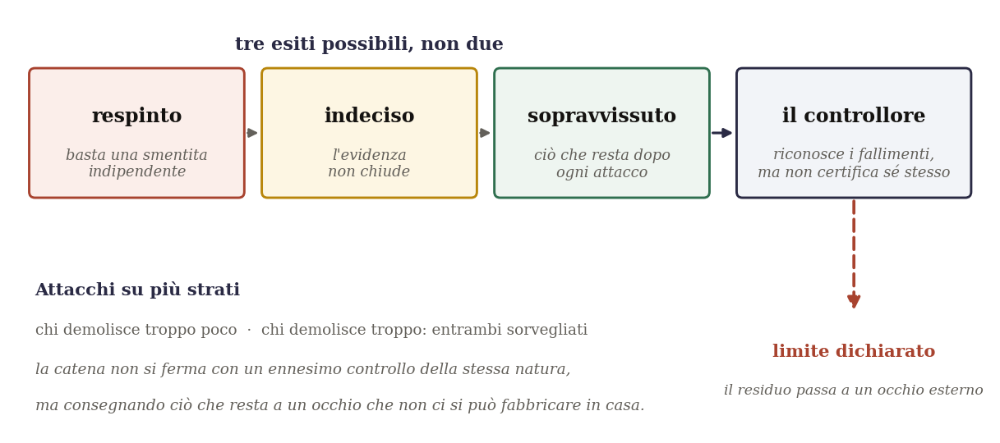
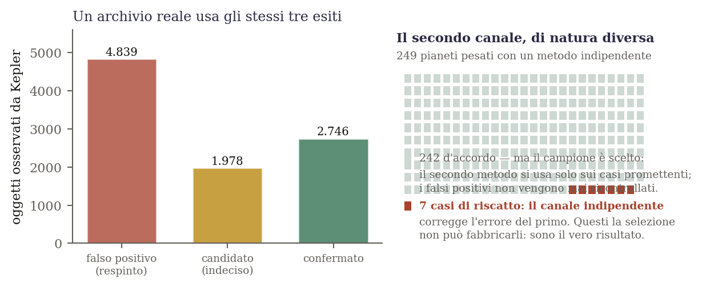
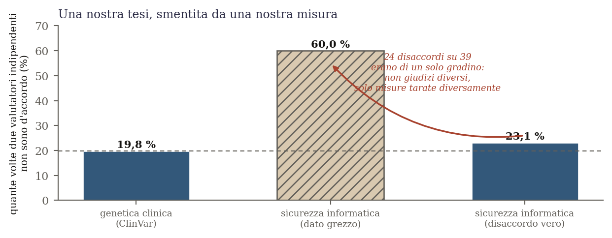
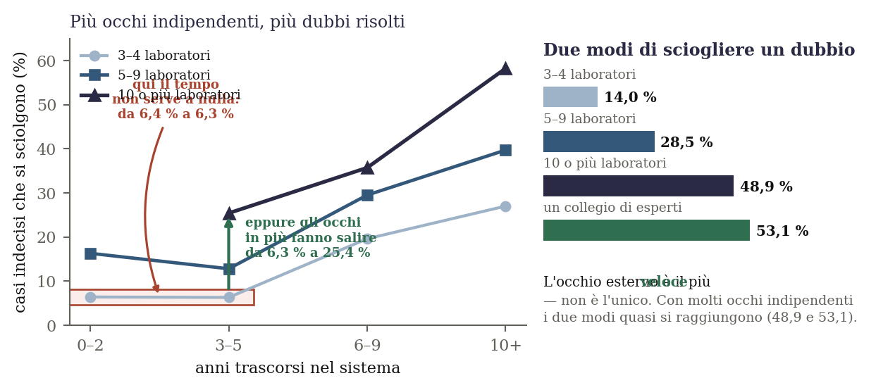

# Possiamo fidarci di ciò che una macchina ci dice?

### Due ricerche sull'affidabilità, raccontate senza gergo

*Edizione italiana leggibile. Questo testo racconta fedelmente i risultati di due articoli
scientifici scritti in inglese e destinati a riviste specialistiche. Non è una semplificazione
di comodo: non c'è un solo risultato che qui venga presentato più grande di quanto sia. Al
contrario, la parte forse più interessante di questa storia è il numero di volte in cui gli
autori hanno dovuto scrivere nero su bianco di essersi sbagliati.*

---

## 1. La domanda da cui nasce tutto

Immagini di dover giudicare se un lavoro è fatto bene. Se lei è un falegname e deve giudicare un
tavolo, ha degli attrezzi: una livella, un metro, la sua esperienza. Gli attrezzi sono *di natura
diversa* dal tavolo, e questo le permette di controllarlo davvero.

Ora immagini invece di dover giudicare **un giudizio**. E di dover usare, per giudicarlo, uno
strumento fatto della stessa pasta di ciò che sta giudicando.

È esattamente ciò che accade oggi quando si usa un'intelligenza artificiale per controllare il
lavoro di un'altra intelligenza artificiale — cosa che si fa continuamente, perché i lavori da
controllare sono troppi perché li guardino solo esseri umani. Ma è anche una situazione antica,
che i filosofi della scienza conoscono da molto tempo. Il primo termometro doveva essere tarato
su qualcosa; ma per sapere se quel qualcosa era affidabile, serviva un termometro. Si chiama
**problema del cerchio**: per validare uno strumento di misura servono assunzioni che dipendono
proprio da ciò che lo strumento dovrebbe misurare.

Il filosofo Hasok Chang ha mostrato che questo cerchio **non si può eliminare**. Non è un errore
da correggere: è la condizione in cui la conoscenza si trova ogni volta che deve partire da zero.

La domanda di queste due ricerche non è quindi *come uscire dal cerchio* — non si esce.
La domanda è: **come si può viverci dentro in modo onesto?**

---

## 2. La proposta: un cancello, e tre esiti invece di due

La prima idea è semplice da dire e difficile da praticare.

Di solito, quando si controlla qualcosa, gli esiti sono due: passa o non passa. Vero o falso.
Qui gli esiti sono **tre**. C'è il *respinto*: basta una sola obiezione indipendente e ben fondata
per buttare giù un'affermazione. C'è il *sopravvissuto*: ciò che resta in piedi dopo che ogni
attacco possibile è stato tentato. E in mezzo, il più importante, c'è **l'indeciso**: il caso in
cui le prove non bastano né a confermare né a smentire, e allora non si conclude. Si dichiara che
non si conclude.

Poi c'è la parte che rende la cosa seria. Se si attacca un'affermazione, bisogna anche sorvegliare
*chi attacca*: perché un attacco troppo zelante distrugge cose che erano buone. Quindi serve un
controllore che sorvegli gli attaccanti. Ma allora chi sorveglia il controllore? Un secondo
controllore. E chi sorveglia il secondo? Si capisce dove finisce: in una catena senza fondo.

Qui sta il cuore della proposta, ed è una scelta quasi morale prima che tecnica. **La catena non si
chiude fingendo che l'ultimo anello sia solido.** Si ferma dichiarando: *«io, che sono fatto della
stessa pasta di ciò che controllo, non posso certificare me stesso. Ecco cosa resta aperto. Lo
consegno a un occhio esterno.»*

Non è una resa. È l'unica cosa onesta che si possa fare stando dentro un cerchio.

---

## 3. L'affidabilità non è un istante, è una storia

La seconda idea è quella da cui questa ricerca è partita molti anni fa, quando l'autore era ancora
all'università.

Un'affermazione, presa in un istante, non ha modo di appoggiarsi a niente di esterno. Ma se la si
lascia vivere nel tempo, e ogni volta la si confronta con una linea di indagine *indipendente* —
qualcuno che guarda la stessa cosa da un'altra disciplina, con altri strumenti, altre parole —
allora ogni confronto è un appiglio che il singolo istante non aveva.

La fiducia, così, **sedimenta**. Non perché una di quelle linee sia la verità: nessuna lo è. Ma
perché è improbabile che molte coperture davvero indipendenti sbaglino ripetutamente *allo stesso
modo*. È il motivo per cui due testimoni che non si sono parlati e raccontano la stessa cosa valgono
più di uno solo.

Con due avvertenze, che nella ricerca sono scritte a chiare lettere. La prima: la fiducia sale
quando le linee convergono, ma **si sospende** quando divergono — non scende mai a «falso», perché
nessuna linea è la verità. La seconda: tutto questo funziona **solo se le linee sono davvero
indipendenti**. Se col tempo cominciano a copiarsi, la loro convergenza non è più una prova: è
un'eco.

---

## 4. Il primo articolo: due modi eleganti di sbagliare

Il primo dei due articoli è quello matematico. Serve a dare una forma precisa alle parole del
paragrafo qui sopra. E il suo contenuto vero — questo è importante — sono **due risultati negativi**:
due modi apparentemente naturali di formalizzare l'idea, che si dimostrano sbagliati.

Il secondo è il più bello, e si può spiegare in tre righe.

Esiste una struttura matematica molto elegante che sembrerebbe fatta apposta per descrivere la
«compatibilità parziale» fra due modi di vedere la stessa cosa. Ma quella struttura richiede una
proprietà chiamata **transitività**: se A è compatibile con B, e B con C, allora A deve essere
compatibile con C.

E la somiglianza, nel mondo reale, non funziona così. Lo psicologo Amos Tversky lo mostrò con un
esempio elementare: la Giamaica somiglia a Cuba, Cuba somiglia alla Russia, ma la Giamaica non
somiglia alla Russia. La compatibilità fra punti di vista è **non transitiva**.

Da qui segue, con una dimostrazione di poche righe, che quella bella struttura matematica **non può
essere la casa** di ciò che si voleva descrivere. L'articolo non trova una struttura migliore: dimostra
che due candidate ovvie sono sbagliate, e dice esattamente perché. In matematica questo è un
contributo modesto ma pulito, e l'articolo lo dichiara per quello che è, senza gonfiarlo.

---

## 5. Il secondo articolo: la prova sul campo

Qui la ricerca fa una cosa che di solito la filosofia non fa: **va a vedere**.

Se è vero che l'affidabilità si costruisce accumulando sguardi indipendenti, con tre esiti invece
di due e con la possibilità di sospendere il giudizio — allora questa struttura dovrebbe
trovarsi nei posti dove gli esseri umani, sul serio e da decenni, costruiscono affidabilità senza
avere una verità già in tasca.

Sono stati esaminati nove grandi archivi pubblici. Cinque sono stati scartati perché non avevano i
requisiti (e il criterio è stato fissato *prima* di guardare, sulla base di un tentativo fallito su
un archivio di nomi medievali, che non ha dato dati puliti ed è raccontato per intero). Tre sono
stati studiati.

### Il primo: i pianeti

Il telescopio spaziale Kepler ha osservato migliaia di oggetti che potrebbero essere pianeti attorno
ad altre stelle. Gli astronomi li classificano in tre modi: *falso positivo*, *candidato*,
*confermato*. Sono esattamente i tre esiti di cui sopra — respinto, indeciso, sopravvissuto — trovati
in natura, non messi lì da noi.

Su alcuni di questi pianeti esiste un secondo metodo di verifica, fisicamente diverso dal primo:
invece di guardare l'ombra del pianeta che passa davanti alla stella, si misura il minuscolo
dondolio che la sua gravità imprime alla stella stessa. Due strumenti diversi, due fisiche diverse.

E qui la prima lezione di onestà. Sui 249 pianeti che hanno entrambe le misure, i due metodi vanno
d'accordo nel 97 % dei casi. Sembra un trionfo. **Non lo è**, e l'articolo lo dice: il secondo
metodo si applica *solo ai casi già promettenti*. I falsi positivi non vengono mai ricontrollati.
È come vantarsi che due esaminatori concordano sempre, quando il secondo esaminatore viene chiamato
soltanto per gli studenti bravi.

Ciò che vale davvero sono **sette casi**. Sette pianeti in cui il metodo indipendente ha detto: *no,
questo è un pianeta vero, il primo metodo lo stava scartando per sbaglio*. Sette è un numero piccolo
e onesto. È il vero risultato di quella parte, ed è quello che l'articolo mette in prima pagina al
posto del 97 %.

### Il secondo: le malattie genetiche

Esiste un archivio, chiamato ClinVar, in cui laboratori di tutto il mondo depositano le loro
valutazioni sulle mutazioni del DNA: questa è pericolosa, questa è innocua, di questa **non si sa**.
Quel «non si sa» ha un nome ufficiale e una casella propria. Ancora una volta: tre esiti, e uno di
essi è la sospensione del giudizio.

*(Va detto con chiarezza: questa ricerca ha guardato soltanto la* struttura *dell'archivio — chi
valuta, a che livello, quando. Non ha mai interpretato clinicamente nessuna mutazione, e nulla di
ciò che è scritto qui va inteso in quel senso.)*

Questo archivio ha una proprietà che i pianeti non avevano: qui il secondo parere c'è **su tutti i
casi**, non solo sui promettenti. E si può quindi misurare, senza trucchi, quanto spesso due
laboratori indipendenti non sono d'accordo. La risposta: **il 19,8 % delle volte**, circa un caso
su cinque.

### Il terzo: le vulnerabilità informatiche

Il terzo archivio raccoglie i difetti di sicurezza dei programmi, valutati per gravità da due enti
indipendenti. È stato scelto apposta perché è lontanissimo dai primi due: se la struttura si fosse
rotta lì, sarebbe stato giusto dirlo.

Non si è rotta. Ma ha prodotto il risultato più imbarazzante e più utile di tutti — quello del
prossimo paragrafo.

---

## 6. Le quattro volte in cui ci siamo dati torto

Questa è la parte della storia che va raccontata per intero, perché è ciò che distingue una ricerca
onesta da un'esibizione.

**La prima.** Il 97 % di accordo fra i due metodi astronomici sembrava una prova. Guardandolo meglio,
era un campione scelto. Ridimensionato, e sostituito con i sette casi.

**La seconda.** Nell'archivio delle vulnerabilità informatiche i due enti risultavano in disaccordo
nel 60 % dei casi — contro il 20 % della genetica. Sembrava una scoperta: *quanto un campo sia
litigioso è una sua proprietà, e varia enormemente*. Era diventata la tesi centrale di quella parte
dell'articolo.

Poi si è andati a guardare *che tipo* di disaccordi fossero. Su 39 disaccordi, **24 erano di un solo
gradino**: due valutatori concordi sul fatto che il difetto fosse grave, e discordi soltanto su
quanto. Non è un disaccordo di giudizio: è uno strumento tarato diversamente. Tolti quelli, il
disaccordo vero è il **23 %**. Contro il 19,8 % della genetica. Lo stesso ordine di grandezza.

La tesi è stata **ritirata**, dentro l'articolo, con il grafico che la smentisce stampato accanto.

**La terza.** Restava il risultato più affascinante: nell'archivio genetico i casi indecisi sembravano
sciogliersi soltanto quando interveniva un collegio di esperti — un'autorità esterna, di natura
diversa dai laboratori. L'accumulo di pareri fra pari, invece, sembrava non servire a nulla. Era una
conferma perfetta della tesi del «limite dichiarato»: solo l'occhio esterno chiude.

Un test più accurato — seguire **le stesse identiche mutazioni** lungo tutta la loro storia, invece di
confrontare gruppi diversi — ha mostrato che era falso. Anche l'accumulo di pareri indipendenti fra
pari scioglie i dubbi. L'occhio esterno è **più veloce** (scioglie il 53 % dei casi contro il 19 %),
ma **non è l'unico**. E quando i pareri indipendenti diventano molti, i due modi quasi si raggiungono:
48,9 % contro 53,1 %.

La tesi non è caduta: si è ristretta, ed è diventata più vera.

**La quarta.** A quel punto restava un'obiezione, e non era piccola. Le mutazioni su cui si sono
espressi dieci laboratori sono, verosimilmente, anche quelle che stanno nell'archivio da più anni.
Quindi forse non era il *numero di occhi* a sciogliere i dubbi: era semplicemente il **tempo che
passa**.

L'unico modo di rispondere era guardare i casi a parità di anni trascorsi. E qui i dati hanno detto
una cosa bellissima.

Fra il secondo e il quinto anno di permanenza nell'archivio, a parità di laboratori coinvolti, il
tempo **non scioglie nulla**: la percentuale di dubbi risolti passa da 6,4 % a 6,3 %. Tre anni in più,
e non cambia niente. Eppure, *dentro quella stessa fascia*, aggiungere occhi indipendenti fa salire i
dubbi risolti da 6,3 % a 25,4 %. Quattro volte tanto.

Dove il tempo non fa niente, l'accumulo di sguardi indipendenti fa tutto. L'obiezione non è stata
soltanto controllata: è stata **smentita sul suo stesso terreno**.

---

## 7. Che cosa resta aperto, e perché deve restare aperto

Due domande non hanno risposta in questi articoli, e non l'avranno da chi li ha scritti.

La prima è una questione tecnica di matematica avanzata: se una certa costruzione, in un certo tipo
di spazio, coincida o no con quella descritta qui. Serve un matematico specialista.

La seconda è se una delle idee filosofiche di fondo sia davvero nuova, oppure sia già stata pensata
da qualcuno in una letteratura che le ricerche fatte non hanno raggiunto. Serve uno studioso che
conosca quella letteratura.

Nessuna quantità di lavoro fatto dall'interno può chiudere queste due domande. E qui la cosa si
richiude su sé stessa in un modo che vale la pena notare, perché è l'unico punto in cui questi
articoli parlano davvero di sé.

Tutta la ricerca sostiene che **un sistema non può certificare la propria affidabilità**, che deve
dichiarare ciò che resta aperto, e consegnarlo a un occhio esterno di natura diversa dalla propria.

Se questi due articoli avessero chiuso da soli tutte le proprie domande, avrebbero smentito la loro
stessa tesi.

Restano aperte. Ed è così che deve essere.

---

## Una nota sul metodo, che forse è la cosa più importante

Queste ricerche sono state condotte usando un'intelligenza artificiale come **strumento avversario**:
non per confermare le idee dell'autore, ma per attaccarle sistematicamente, per riscrivere da zero i
verificatori, per rifare i conti in modo indipendente, e per dire — quando era il caso — che
un'affermazione non reggeva.

Quattro volte lo strumento, o le misure che l'autore stesso aveva progettato, hanno demolito una tesi
dell'autore. Tutte e quattro le demolizioni sono stampate dentro gli articoli, con i grafici che le
mostrano.

Non è una cosa comune. Ed è, alla fine, l'unico argomento davvero forte che questi due lavori possano
portare a proprio favore: non che siano giusti, ma che abbiano fatto tutto il possibile per scoprire
di essere sbagliati.

---

*Gli articoli originali, i dati e i programmi che li verificano sono pubblici e chiunque può
rieseguirli. Il motore avversariale che li ha attaccati si trova qui:
**github.com/eddo-cto/adversarial-audit-engine**. Ogni numero citato in questo testo proviene da
archivi aperti — della NASA, dei National Institutes of Health americani, e dell'ente americano per
la sicurezza informatica — e nessuna valutazione è stata affidata al giudizio di una macchina.*
